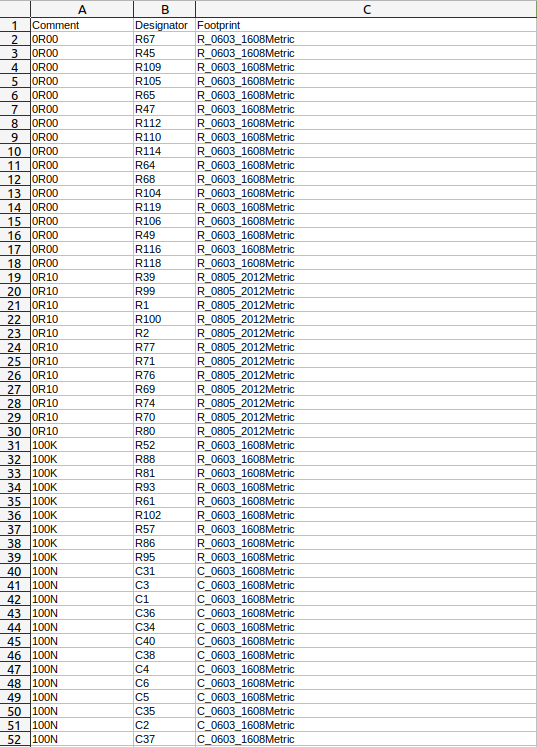
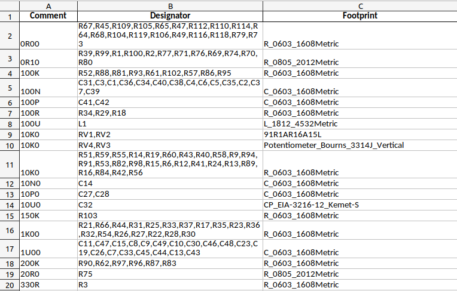

# spreadsheet-wrangler
Command line tool for interacting with spreadsheet data

## Installation
### pypi
```
pip install spreadsheet-wrangler
```

### Source
```
git clone https://github.com/snhobbs/spreadsheet-wrangler.git
cd spreadsheet-wrangler
pip install .
```

## Functions
- merge: Left merge two spreadsheets and save as xlsx
- compare: Compare two spreadsheets on a column name, prints out the discrepencies
- cluster: Combine the same values in a specified column as an array with the same name as the clustered column. The remainder of the first rows data is kept.
- uncluster: Unpack clustered columns into one entry for each. The row is duplicated for each entry.
- filter

## Usage Examples
These examples follow the use case of working with a bill of materials (BOM). A specialized tool that uses this library for this use case is
available here[https://github.com/snhobbs/BOMTools].

### Expand a list of designators and unique identifiers with additional data
To expand a list of reference designators and unique identifier of a part (bom.xlsx) with
additionally available data (data_store.xlsx) use the spreadsheet_wrangler tool:
```
spreadsheet_wrangler.py merge --on="pn" -l bom.xlsx -r data_store.xlsx -p '{"pn":["Internal Part Number"]}'
```
Any unique identifier will work, examples are: manufacturers part number, internal part number, index to a database, etc.
Equivilent names for columns are passed to the tool in a JSON format. A file titled bom_Merged_data_store_On_pn.xlsx will be generated with this command.

### Compare the data in two BOMS
To compare the available data of two BOMs to compare function of spreadsheet_wrangler should be used. If a BOM was exported
and needs to be checked against another with questionable history run:
```
spreadsheet_wrangler.py compare --on="ref-des" -l bom.xlsx -r bom_Merged_data_store_On_pn.xlsx
```
This will compare the original BOM with the merged one from the first example. Comparisons are done column by column with rows matched by the value in the column passed with the argument "--on". This should be a unique for each instance of a part (i.e a ref des). 
The shared columns will be checked as well as any passed in with the --columns argument. Discrepencies are printed to screen.

### Generate a BOM sorted by the type of parts
BOMs used for ordering, shipping, budgeting, or shipping to a CM are typically ordered by the type of part.

The ordering BOM sorts by reference designator and combines the BOM into unique part types. This can then be used for ordering or quoting. This can be passed to a tool like kicost or used with supplier BOM Managers or the Octopart BOM Manager (recommended).

To sort a BOM by the type of part and with a list of the reference designators run:
```
spreadsheet_wrangler.py cluster --column="ref-des" --on="pn" -s bom_clustered_on_ref-des.xlsx
```

### Compare a BOM sorted by the type of parts with a design BOM
To compare a BOM sorted by the part type (as shown above) with a BOM sorted by reference designator the BOM needs to be unpacked first and then compared.
To unpack run:
```
spreadsheet_wrangler.py uncluster --column="ref-des" -s bom_unclustered.xlsx
```
This will seperate the lines like the original bom.xlsx. This BOM can now be compared using the compare function described above.

NOTE: Note the data in each grouped row is duplicated for each clustered element. This is not necessarily correct if data was dissimilar and lost during the clustering step.

### Clustering a partially filled in BOM
After exporting a design BOM with each component in it's own line you end up with what I call a design BOM except without the useful fields included. 



For this I want to cluster based on "Comment" and "Footprint", that is I want all 0603 10K resistors together and not include any other 0603 or 10K parts in the cluster. The command would then be:

```
spreadsheet_wrangler.py cluster --spreadsheet BOM-1x2_tester.csv --column "Designator" --on "Comment" --on "Footprint" -o BOM_clustered.xlsx
```
This call turns the above BOM into:


